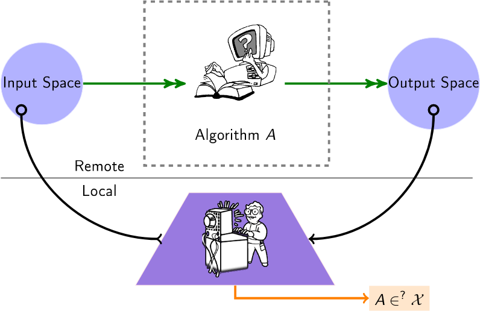

# 1rst Workshop on Algorithmic Audits of Algorithms (WAAA)
## May 23rd 2023 - Online (Zoom): 8am EST (2pm CET) 

Nowadays, many crucial algorithms (recommendation, scoring, ranking and classification) are operated at third party providers, without users or institutions having any insights on how they operate on their data. Such a black-box setup challenges scientists to show what is [feasible in terms of audits](https://github.com/erwanlemerrer/awesome-audit-algorithms), both on theoretical and efficiency-oriented aspects.\
This workshop aims at summing up the current state of algorithmic-audits through recent scientific advances.

## Program

1:45-2pm : Welcome
2:00-2:30: Tubes & Bubbles - Topological confinement of YouTube recom (PLOS ONE 2020)
2:30-3:00: You can't have your API and trust it too: reliable audits with a little help
3:00-3:30: Confidential-PROFITT: Confidential PROof of FaIr Training of Trees (ICLR 2023)
3:30-4:00: Auditing for discrimination in ad delivery, with and without platform support (CSCW 2023)
4:00-4:30: A zest of lime: towards architecture-independent model distances (ICLR 2022)
4:30-5:00: Active fairness auditing (ICML 2022)
5:00     : wrap-up and open discussion

## Organization
* Erwan Le Merrer, Inria
* Gilles Tredan, CNRS

Contact: waaa@gozmail.net
