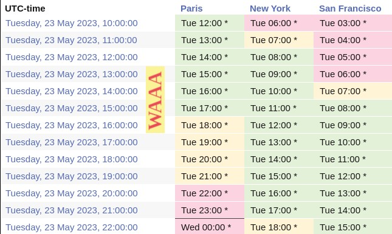

# 1rst Workshop on Algorithmic Audits of Algorithms (WAAA)
## May 23rd 2023 - Online (Zoom): 8:45am New York (2:45pm Paris) 

Nowadays, many crucial algorithms (recommendation, scoring, ranking and classification) are operated at third party providers, without users or institutions having any insights on how they operate on their data. Such a black-box setup challenges scientists to show what is [feasible in terms of audits](https://github.com/erwanlemerrer/awesome-audit-algorithms), both on theoretical and efficiency-oriented aspects.\
This workshop aims at summing up the current state of algorithmic-audits through recent scientific advances.

*The workshop will take place online (Zoom), please register to attend (see below).*

## Program

14:45-15:00(Paris)/08:45-09:00(New York): Welcome

15:00-15:30(Paris)/09:00-09:30(New York): [**Tubes & Bubbles - Topological confinement of YouTube recommendations**](https://journals.plos.org/plosone/article?id=10.1371/journal.pone.0231703) (PLOS ONE 2020)

15:30-16:00(Paris)/09:30-10:00(New York): [**On the relevance of APIs facing fairwashed audits**]() (arXiv 2023)

16:00-16:30(Paris)/10:00-10:30(New York): [**Confidential-PROFITT: Confidential PROof of FaIr Training of Trees**](https://openreview.net/forum?id=iIfDQVyuFD) (ICLR 2023)

16:30-17:00(Paris)/10:30-11:00(New York): [**Auditing for discrimination in ad delivery, with and without platform support**](https://dl.acm.org/doi/abs/10.1145/3579610) (CSCW 2023)

17:00-17:30(Paris)/11:00-11:30(New York): [**A zest of lime: towards architecture-independent model distances**](https://openreview.net/forum?id=OUz_9TiTv9j) (ICLR 2022)

17:30-18:00(Paris)/11:30-12:00(New York): [**Active fairness auditing**](https://proceedings.mlr.press/v162/yan22c/yan22c.pdf) (ICML 2022)

18:00(Paris)/12:00(New York)            : wrap-up

## Registration

Registration is free but mandatory here: [*registration page*](https://framaforms.org/registration-for-waaa-may-23rd-1678973540). You will be sent an email with the zoom link.

## Various

A [poster](https://github.com/algorithmic-audits/algorithmic-audits.github.io/blob/main/poster_WAAA_2023.pdf) for publicizing the event.

Timezones:

## Organization

* Erwan Le Merrer, Inria, France
* Gilles Tredan, CNRS, France
